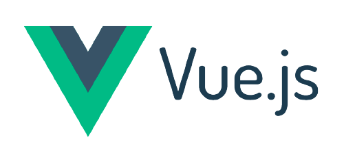
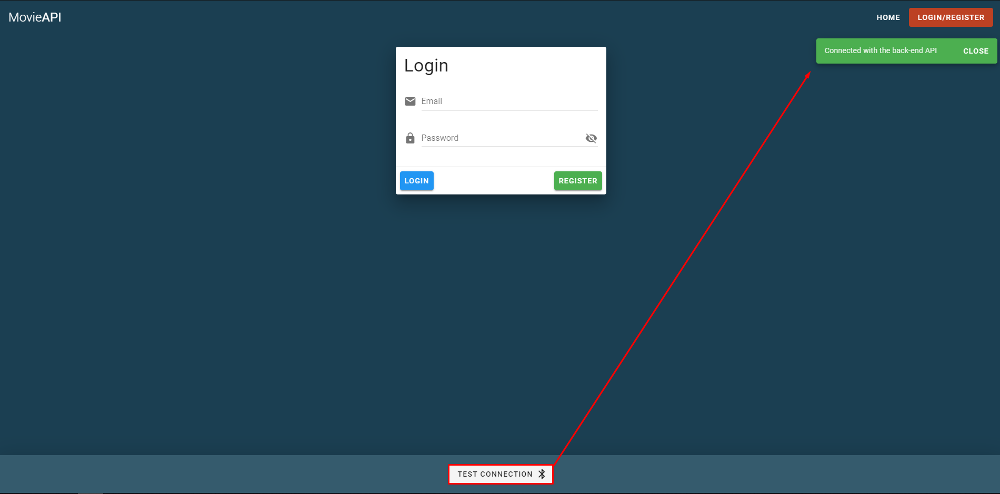

<h1 align="center">
  </a>
</h1>

<h2 align="center">VueJS UI Reference Implementation</h2>

<p align="center">
  <a href="#about">About</a> ◈
  <a href="#build-and-run">Build and run</a> ◈
  <a href="#how-to-test">How to test</a> ◈
  <a href="#changelog">Changelog</a>
</p>

## About

A front-end SPA application built with VueJS. It implements [JWT authentication](https://jwt.io/), [Vuex](https://vuex.vuejs.org/guide/) for storage, [VueRouter](https://router.vuejs.org/) for routing and [Vuetify](https://vuetifyjs.com/en/) for UI.

As of now it goes hand in hand with my other projects such as
[Car API](https://github.com/PatriQ94/CarAPITemplate), which serve as the back-end for authentication and data retrieval. In order to fully see the front-end and the back-end working together you **need to run both projects at the same time.**

**The main purpose of the project is to be used as a reference implementation in case of need.**

## Build and run

**1. Create a folder for your repository**

Create a folder on local computer to clone the repo, something like `C:\source` will be fine.

**2. Clone [VueUITemplate repository from Github](https://github.com/PatriQ94/VueUITemplate.git)**

Open cmd within newly created folder and execute the following command.

```console
git clone https://github.com/PatriQ94/VueUITemplate.git
```

**3. Install npm packages**

```console
cd VueUITemplate
npm install
```

**4. Run the application**

- Development:

```
npm run serve
```

- Production:

```
npm run build
```

**5. View the application in your browser**

Open your favourite browser and visit `http://localhost:8080`

## How to test

Once the application is up and running on URL `http://localhost:8080` you can test if the back-end API is accessible by clicking the button on the bottom of the screen saying `Check connection with back-end`



If the back-end API is accessible, you will receive a green notification. If not, a red notification will appear.

If back-end is accessible, feel free to register a new account and then explore the rest :)

## Changelog

| Edited   | Comment                                                                                |
| -------- | -------------------------------------------------------------------------------------- |
| 1.7.2020 | Project creation, added storage, added routing                                         |
| 2.7.2020 | Added Vuetify, added login UI                                                          |
| 6.7.2020 | Finished login and register, added check connection to back-end, progress on Garage UI |
| 8.7.2020 | Improved docs, progress on Add new car popup                                           |
